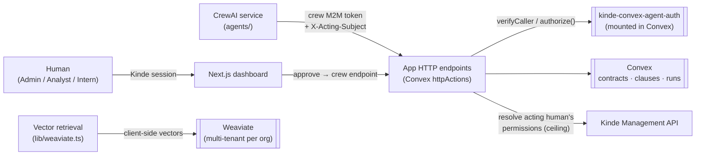

# Contract Intelligence — the confused deputy, and the fix

A runnable demo of the **confused deputy problem in AI agents** — and how to fix it with **permission intersection** using the [`kinde-convex-agent-auth`](https://github.com/kinde-oss/kinde-convex-agent-auth) Convex component.

An AI "contract review crew" reads a contract, flags risky clauses, and approves safe ones — **on behalf of a signed-in human**. Flip one server-side switch, `AUTHZ_MODE`, and watch the same flow go from broken to fixed:

- **`broken`** — the app authorizes agent actions on the **agent's own identity alone**. A read-only **Intern** can trigger a review in which the crew **approves a high-risk clause the Intern could never approve**. The acting human's permissions are never consulted. This is the confused deputy.
- **`intersection`** — the app authorizes each action as **the acting human's permissions ∩ the agent's**, via the component's `authorize()`. The same Intern approval is now **denied** (`403 insufficient_scope`, with a machine-readable reason, a `correlationId`, and an audit row); the **Admin**, who holds `clauses:approve`, is **allowed**.

[](https://makeapullrequest.com) [](https://kinde.com/docs/developer-tools) [](https://thekindecommunity.slack.com)

> **Note:** the `kinde-convex-agent-auth` component is currently **vendored from a tarball** (`vendor/…​.tgz`, wired as a `file:` dependency) because the `@kinde-oss/kinde-convex-agent-auth` package is not published yet. When it ships to npm, swap the `file:` dependency for the published version — no other code change is required.

## What proves it

One command runs the whole before/after against the real stack and asserts every step:

```bash
npm run e2e        # scripts/e2e-narrative.ts
```

> reset → **broken**: crew as the Intern _approves_ a high-risk clause → reset → **intersection**: crew as the Intern is _denied_ (403 + correlationId), the Admin is _allowed_ → the audit trail contains the matching deny/allow rows.

## Architecture



- **Next.js + Convex.** The app runs on Convex, with `kinde-convex-agent-auth` **mounted as a component**. Convex `httpActions` are the crew's HTTP surface; the Next.js dashboard is behind a Kinde session.
- **CrewAI service (`agents/`).** A Python service that mints its own **crew M2M** token and calls the app over HTTP, carrying the acting human's id in an `X-Acting-Subject` header. It never touches Convex or Weaviate directly.
- **Weaviate.** Contract clauses are embedded with **client-side vectors** (Transformers.js `all-MiniLM-L6-v2`, a `none` vectorizer) into **native multi-tenant** storage (one tenant per org). Local Docker and Weaviate Cloud are interchangeable — only `WEAVIATE_URL` + `WEAVIATE_API_KEY` change.
- **Kinde** provides one **human** identity type (with roles → permissions) and **two machine identities** — see below.

### Two Kinde M2M apps are required (and why)

| M2M app | Audience | Used for |
| --- | --- | --- |
| **Crew** | `contract-intelligence-api` | The agent's own identity. The crew mints a token with this app and presents it to the app; the component's `verifyCaller`/`authorize` verify it. Its scopes are deliberately broad — that gap is the whole point of the demo. |
| **Kinde Management API** | `https://<tenant>.kinde.com/api` | Resolving a human's permission **ceiling** from Kinde. In intersection mode, at review-start the app calls the Management API to read the acting human's org permissions and issues their delegation from that — no hardcoded map. |

They are separate because they authenticate to **different audiences** for **different purposes**: the crew _is_ an agent calling this app's API; the Management app _reads Kinde itself_ to discover what a human is allowed to do.

## Setup

Prerequisites: **Node 22+**, **Python 3.10–3.13**, a **Kinde** account, a **Convex** account, an **Anthropic API key** (for the LLM crew), and **Docker** (only if you run Weaviate locally).

### 1. Install

```bash
git clone <this repo>
cd contract-intelligence-demo
npm install
```

### 2. Kinde → see [`docs/kinde-setup.md`](./docs/kinde-setup.md) for the full walkthrough

Create, in your Kinde tenant:

- **Permissions:** `contracts:read`, `clauses:flag`, `clauses:approve`.
- **Roles:** **Admin** (all three), **Analyst** (read + flag), **Intern** (read only). The app enforces on the _permission_, never the role.
- An **organization**; add three test users, one per role.
- A **back-end web application** (human sign-in) → `KINDE_CLIENT_ID` / `KINDE_CLIENT_SECRET`; allow callback `http://localhost:3000/api/auth/kinde_callback`.
- An **API** whose audience is `contract-intelligence-api`.
- The **two M2M applications** above (crew + Management API), with the scopes described. Grant the crew the three permissions as scopes; grant the Management app read access to org users + permissions.

### 3. Convex + environment

```bash
npx convex dev        # creates/links a deployment, writes NEXT_PUBLIC_CONVEX_URL to .env.local
```

Set the deployment env (server-side secrets) with `npx convex env set …`:

| On the Convex deployment | On `.env.local` (the app) |
| --- | --- |
| `KINDE_DOMAIN`, `KINDE_ISSUER_URL`, `KINDE_CLIENT_ID`, `KINDE_AUDIENCE` | `KINDE_CLIENT_ID`, `KINDE_CLIENT_SECRET`, `KINDE_ISSUER_URL`, `KINDE_SITE_URL`, `KINDE_POST_LOGIN_REDIRECT_URL`, `KINDE_POST_LOGOUT_REDIRECT_URL` |
| `DELEGATION_SIGNING_SECRET` (32+ chars), `MODE=live` | `KINDE_AUDIENCE`, `CREW_M2M_CLIENT_ID`, `CREW_M2M_CLIENT_SECRET` |
| `KINDE_MGMT_CLIENT_ID`, `KINDE_MGMT_CLIENT_SECRET` | `NEXT_PUBLIC_CONVEX_URL`, `NEXT_PUBLIC_CONVEX_SITE_URL` |
| `AUTHZ_MODE` (`broken` \| `intersection`) | `WEAVIATE_URL`, `WEAVIATE_API_KEY` |

See [`.env.example`](./.env.example) for every variable with a one-line comment. Then register the crew as an agent (once):

```bash
CREW_M2M_CLIENT_ID=<id> ORG_CODE=<org_code> ./scripts/provision-agent.sh
```

### 4. Weaviate → see [`docs/weaviate-setup.md`](./docs/weaviate-setup.md)

Recommended: a **Weaviate Cloud** cluster — set `WEAVIATE_URL` (REST endpoint) + `WEAVIATE_API_KEY`. That's the whole difference from local. For local dev:

```bash
./scripts/weaviate-up.sh                    # bare Weaviate on Docker
npx tsx scripts/weaviate-isolation-check.ts # proves cross-org tenant isolation
```

### 5. Python CrewAI service → see [`docs/agent-service.md`](./docs/agent-service.md)

```bash
cd agents
python3 -m venv .venv && . .venv/bin/activate
pip install -e .
# configure agents/.env (endpoints, crew M2M creds, ANTHROPIC_API_KEY); see agents/.env.example
```

## Running the demo

```bash
npm run dev                          # the dashboard at http://localhost:3000
npx tsx scripts/reset-demo.ts        # a clean demo org (intersection mode)
```

Sign in as the **Intern**, open a contract, tick _"reveal approve controls"_, and Approve a clause. Flip the mode and watch the outcome change — the mode is **decided by the server**, not the caller:

```bash
npx convex env set AUTHZ_MODE broken        # confused deputy
npx tsx scripts/repro-confused-deputy.ts    # Intern APPROVES a high-risk clause

npx convex env set AUTHZ_MODE intersection  # the fix
npx tsx scripts/repro-intersection-fix.ts   # Intern DENIED (403 insufficient_scope
                                            # + correlationId + audit row); Admin ALLOWED
```

In the dashboard, an Intern who forces the approve in intersection mode sees the backend **403** with its reason and `correlationId` surfaced in the UI. The audit panel shows every component decision (allow/deny, action, reason, the ceiling used, correlationId). Or run the whole arc in one command with `npm run e2e`.

## Tests

```bash
npm test                                 # Convex/vitest (incl. the mode-flip authz test)
cd agents && .venv/bin/python -m pytest  # the crew wiring
```

`convex/authzIntersection.test.ts` is the CI-friendly narrative: it drives both modes through the HTTP layer with a stubbed Kinde/JWKS and Management API, so it needs no live credentials.

## Documentation

- [`docs/kinde-setup.md`](./docs/kinde-setup.md) — Kinde permissions, roles, org, web app, and the two M2M apps (with scopes).
- [`docs/weaviate-setup.md`](./docs/weaviate-setup.md) — tenancy, client-side vectors, local vs Cloud.
- [`docs/agent-service.md`](./docs/agent-service.md) — the CrewAI service, the token + acting-subject flow, and the endpoints.

## Contributing

Please refer to Kinde's [contributing guidelines](https://github.com/kinde-oss/.github/blob/489e2ca9c3307c2b2e098a885e22f2239116394a/CONTRIBUTING.md).

## License

By contributing to Kinde, you agree that your contributions will be licensed under its MIT License.
