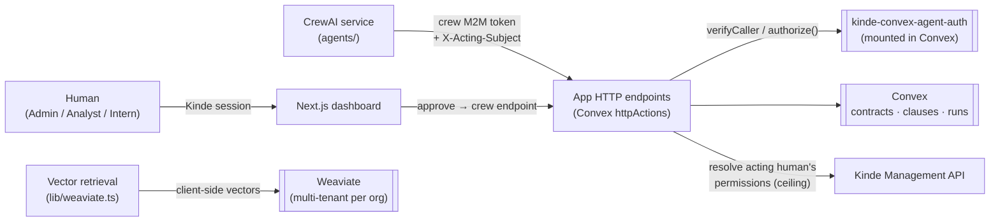

# Contract Intelligence: see an AI agent get tricked, and Kinde stop it

A standalone demo of the confused deputy problem in AI agents. It shows how Kinde fixes the problem with permission intersection, using the [`kinde-convex-agent-auth`](https://github.com/kinde-oss/kinde-convex-agent-auth) Convex component.

Open it in a browser and watch it happen. Pick who you're acting as (Intern, Analyst, or Admin, all real pre-provisioned Kinde users), or sign in as yourself. Point an AI "contract review crew" at a contract, choose the enforcement mode, and hit Run. A live timeline streams every step the agent takes. When the crew tries to sign off a high-risk clause, the key moment shows up:

- **Broken.** The app authorizes agent actions on the agent's own identity alone. A read-only Intern triggers a review in which the crew approves a high-risk clause the Intern could never approve. The human's permissions are never consulted. That is the confused deputy.
- **Intersection.** Each action is authorized as the acting human's permissions intersected with the agent's, via the component's `authorize()`. The same Intern sign-off is denied (`403 insufficient_scope`, with a reason, a `correlationId`, and an audit row). The Admin, who holds `clauses:approve`, is allowed.

Everything is real: real Kinde sessions, permissions resolved live from Kinde, a real 403. The receipts (the clause table and the component's audit trail) are one click away, and a timeline denial ties to its audit row by `correlationId`.

[](https://makeapullrequest.com) [](https://kinde.com/docs/developer-tools) [](https://thekindecommunity.slack.com)

> **Note:** the `kinde-convex-agent-auth` component is currently **vendored from a tarball** (`vendor/…​.tgz`, wired as a `file:` dependency) because the `@kinde-oss/kinde-convex-agent-auth` package is not published yet. When it ships to npm, swap the `file:` dependency for the published version. No other code change is required.

## What proves it

One command runs the whole before/after against the real stack and asserts every step:

```bash
npm run e2e        # scripts/e2e-narrative.ts
```

> reset → **broken**: crew as the Intern _approves_ a high-risk clause → reset → **intersection**: crew as the Intern is _denied_ (403 + correlationId), the Admin is _allowed_ → the audit trail contains the matching deny/allow rows.

## Architecture



- **Next.js + Convex.** The app runs on Convex, with `kinde-convex-agent-auth` **mounted as a component**. Convex `httpActions` are the crew's HTTP surface; the Next.js dashboard is behind a Kinde session.
- **CrewAI service (`agents/`).** A Python service that mints its own **crew M2M** token and calls the app over HTTP, carrying the acting human's id in an `X-Acting-Subject` header. It never touches Convex or Weaviate directly.
- **Weaviate.** Contract clauses are embedded with **client-side vectors** (Transformers.js `all-MiniLM-L6-v2`, a `none` vectorizer) into **native multi-tenant** storage (one tenant per org). Local Docker and Weaviate Cloud are interchangeable. Only `WEAVIATE_URL` and `WEAVIATE_API_KEY` change.
- **Kinde** provides one human identity type (with roles that grant permissions) and two machine identities, described below.

### Two Kinde M2M apps are required (and why)

| M2M app | Audience | Used for |
| --- | --- | --- |
| **Crew** | `contract-intelligence-api` | The agent's own identity. The crew mints a token with this app and presents it to the app; the component's `verifyCaller`/`authorize` verify it. Its scopes are deliberately broad. That gap is the whole point of the demo. |
| **Kinde Management API** | `https://<tenant>.kinde.com/api` | Resolving a human's permission **ceiling** from Kinde. In intersection mode, at review-start the app calls the Management API to read the acting human's org permissions and issues their delegation from that, with no hardcoded map. |

They are separate because they authenticate to **different audiences** for **different purposes**: the crew _is_ an agent calling this app's API; the Management app _reads Kinde itself_ to discover what a human is allowed to do.

## Setup

Prerequisites: **Node 22+**, **Python 3.10–3.13**, a **Kinde** account, a **Convex** account, an **Anthropic API key** (for the LLM crew), and **Docker** (only if you run Weaviate locally).

### 1. Install

```bash
git clone https://github.com/kinde-starter-kits/contract-intelligence-demo.git
cd contract-intelligence-demo
npm install
```

### 2. Kinde → see [`docs/kinde-setup.md`](./docs/kinde-setup.md) for the full walkthrough

Create, in your Kinde tenant:

- **Permissions:** `contracts:read`, `clauses:flag`, `clauses:approve`.
- **Roles:** **Admin** (all three), **Analyst** (read + flag), **Intern** (read only). The app enforces on the _permission_, never the role.
- An **organization**; add three test users, one per role.
- A **back-end web application** (human sign-in) → `KINDE_CLIENT_ID` / `KINDE_CLIENT_SECRET`; allow callback `http://localhost:3000/api/auth/kinde_callback`.
- An **API** whose audience is `contract-intelligence-api`.
- The **two M2M applications** above (crew + Management API), with the scopes described. Grant the crew the three permissions as scopes; grant the Management app read access to org users + permissions.

### 3. Convex + environment

```bash
npx convex dev        # creates/links a deployment, writes NEXT_PUBLIC_CONVEX_URL to .env.local
```

Set the deployment env (server-side secrets) with `npx convex env set …`:

| On the Convex deployment | On `.env.local` (the app) |
| --- | --- |
| `KINDE_DOMAIN`, `KINDE_ISSUER_URL`, `KINDE_CLIENT_ID`, `KINDE_AUDIENCE` | `KINDE_CLIENT_ID`, `KINDE_CLIENT_SECRET`, `KINDE_ISSUER_URL`, `KINDE_SITE_URL`, `KINDE_POST_LOGIN_REDIRECT_URL`, `KINDE_POST_LOGOUT_REDIRECT_URL` |
| `DELEGATION_SIGNING_SECRET` (32+ chars), `MODE=live` | `KINDE_AUDIENCE`, `CREW_M2M_CLIENT_ID`, `CREW_M2M_CLIENT_SECRET` |
| `KINDE_MGMT_CLIENT_ID`, `KINDE_MGMT_CLIENT_SECRET` | `KINDE_MGMT_CLIENT_ID`, `KINDE_MGMT_CLIENT_SECRET` (guest-role resolution) |
| `AUTHZ_MODE` (`broken` \| `intersection`) | `NEXT_PUBLIC_CONVEX_URL`, `NEXT_PUBLIC_CONVEX_SITE_URL`, `WEAVIATE_URL`, `WEAVIATE_API_KEY` |
| `DEMO_MODE_SELECTABLE` (`true` to pick mode per-run in the UI) | `DEMO_ORG_CODE`, `DEMO_INTERN_SUBJECT`, `DEMO_ANALYST_SUBJECT`, `DEMO_ADMIN_SUBJECT` (the guest test users) |

The **guest role switcher** maps a role to a pre-provisioned Kinde user id (`DEMO_*_SUBJECT`, config not secrets) and resolves that user's permissions live via the Management API, so "act as Intern/Analyst/Admin" is really enforced, not faked. `CREW_SERVICE_URL` is optional (only for the BYOK LLM crew service). See [`.env.example`](./.env.example) for every variable with a one-line comment. Then register the crew as an agent (once):

```bash
CREW_M2M_CLIENT_ID=<id> ORG_CODE=<org_code> ./scripts/provision-agent.sh
```

### 4. Weaviate → see [`docs/weaviate-setup.md`](./docs/weaviate-setup.md)

Recommended: a Weaviate Cloud cluster. Set `WEAVIATE_URL` (the REST endpoint) and `WEAVIATE_API_KEY`. That's the whole difference from local. For local dev:

```bash
./scripts/weaviate-up.sh                    # bare Weaviate on Docker
npx tsx scripts/weaviate-isolation-check.ts # proves cross-org tenant isolation
```

### 5. Python CrewAI service → see [`docs/agent-service.md`](./docs/agent-service.md)

```bash
cd agents
python3 -m venv .venv && . .venv/bin/activate
pip install -e .
# configure agents/.env (endpoints, crew M2M creds, ANTHROPIC_API_KEY); see agents/.env.example
```

## Running the demo

```bash
npm run dev        # http://localhost:3000  (redirects to the guided demo)
```

The whole flow is guided in the browser, with no sign-up needed to try it:

1. **Act as.** Pick Intern, Analyst, or Admin (a real pre-provisioned Kinde user), or sign in as yourself. Permissions are resolved live, so what you can do is really enforced.
2. **Pick a contract.** Load the sample Acme MSA, or upload your own `.txt` (split into clauses and embedded on the spot).
3. **Enforcement mode.** Broken (the problem) or Intersection (the fix).
4. **Run.** Deterministic (no key, instant) or Crew (LLM) with your own key (BYOK: used for that run only, never stored, never logged).
5. **Watch.** The live timeline streams every step, with an inline callout at the moment the high-risk clause is approved on the agent's authority (broken) or blocked by Kinde (intersection).
6. **The receipts.** Expand the clauses table and the audit trail. A timeline denial and its audit row share the same `correlationId`.

Switching the enforcement mode from the UI per run needs `DEMO_MODE_SELECTABLE=true` on the deployment. Otherwise the mode is whatever `AUTHZ_MODE` is, and the calling agent can never choose it. Re-running is clean: press Run again, flipping the mode to compare. For a totally fresh org, run `npx tsx scripts/reset-demo.ts`.

### Prove it without the UI

The mode is **decided by the server**, never the calling agent. Flip it and run the repro scripts, or run the whole before/after arc with `npm run e2e` (see [What proves it](#what-proves-it)):

```bash
npx convex env set AUTHZ_MODE broken        && npx tsx scripts/repro-confused-deputy.ts
npx convex env set AUTHZ_MODE intersection  && npx tsx scripts/repro-intersection-fix.ts
```

## Run the crew (LLM mode) locally

The hosted demo runs the Deterministic engine: no key, and it proves the same authorization flow (start, assess, flag, attempt sign-off, allow or deny). The only difference from Crew mode is that rule-based steps drive it instead of a real LLM. Crew (LLM) mode runs an actual [CrewAI](https://www.crewai.com/) agent crew against your own model key, on a small Python service you run on your own machine. It is intentionally not hosted, so your key stays with you.

1. **Clone and install the app.** Follow [Setup](#setup) above and get the app running with `npm run dev`.
2. **Start the Python crew service** (from `agents/`):

   ```bash
   cd agents
   python3 -m venv .venv && . .venv/bin/activate
   pip install -e '.[service]'
   uvicorn contract_crew.service:app --port 8790   # any free port
   ```

3. **Point the app at it.** Add this to your `.env.local` (it's read by the app's `/api/run` route, not Convex) and restart `npm run dev`:

   ```bash
   CREW_SERVICE_URL=http://localhost:8790
   ```

4. **Run it.** On the review screen choose Crew (LLM), paste your Anthropic or OpenAI key, and Run. The key is BYOK: sent with that one run, used only for it, and never stored, never logged, never placed in a server env var. Everything else is identical to Deterministic. The mode toggle (broken or intersection) and the per-role allow/deny behave exactly the same, because the authorization boundary is the same.

On the hosted demo (no `CREW_SERVICE_URL` configured), the Crew (LLM) button explains this and links back here instead of running.

## Tests

```bash
npm test                                 # Convex/vitest (incl. the mode-flip authz test)
cd agents && .venv/bin/python -m pytest  # the crew wiring
```

`convex/authzIntersection.test.ts` is the CI-friendly narrative: it drives both modes through the HTTP layer with a stubbed Kinde/JWKS and Management API, so it needs no live credentials.

## Documentation

- [`docs/kinde-setup.md`](./docs/kinde-setup.md): Kinde permissions, roles, org, web app, and the two M2M apps (with scopes).
- [`docs/weaviate-setup.md`](./docs/weaviate-setup.md): tenancy, client-side vectors, local vs Cloud.
- [`docs/agent-service.md`](./docs/agent-service.md): the CrewAI service, the token and acting-subject flow, and the endpoints.

## Contributing

Please refer to Kinde's [contributing guidelines](https://github.com/kinde-oss/.github/blob/489e2ca9c3307c2b2e098a885e22f2239116394a/CONTRIBUTING.md).

## License

By contributing to Kinde, you agree that your contributions will be licensed under its MIT License.
